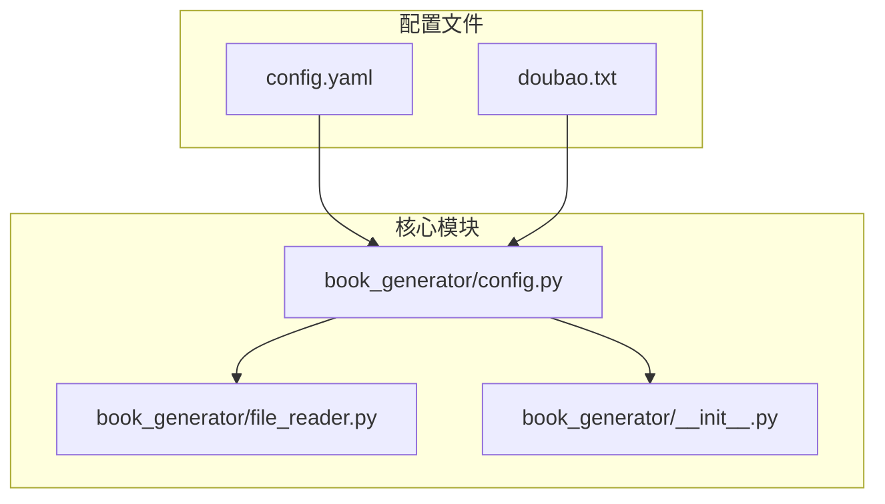
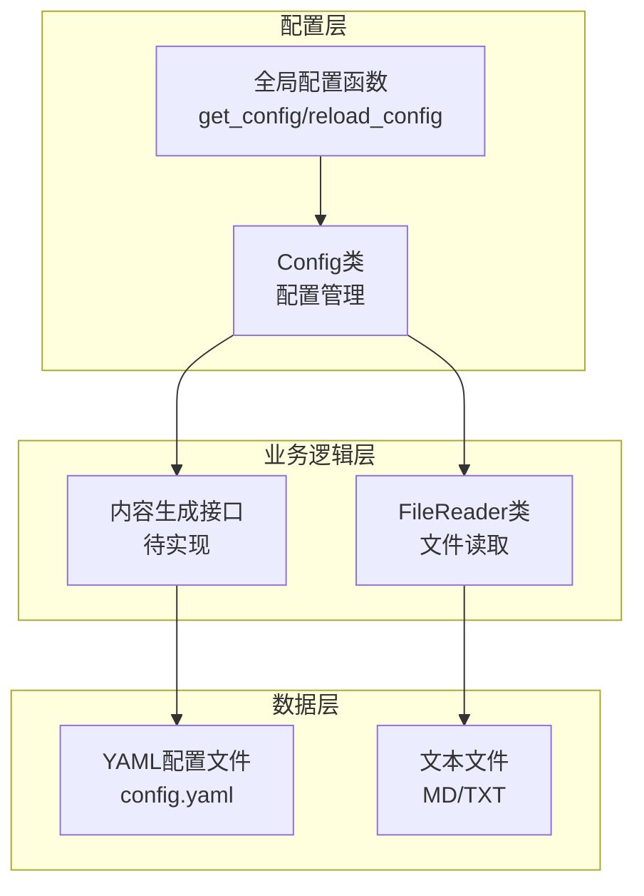
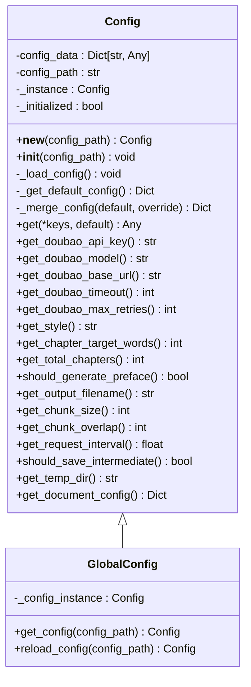
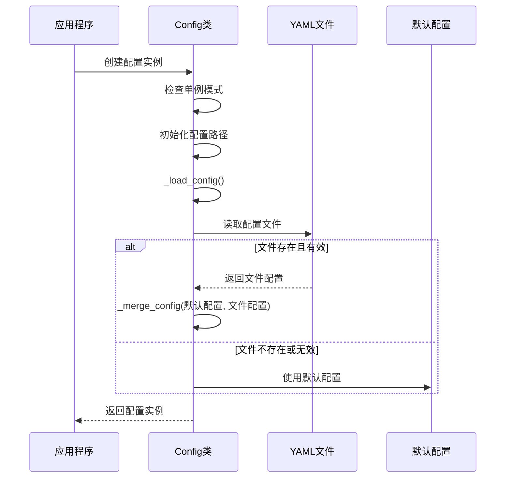
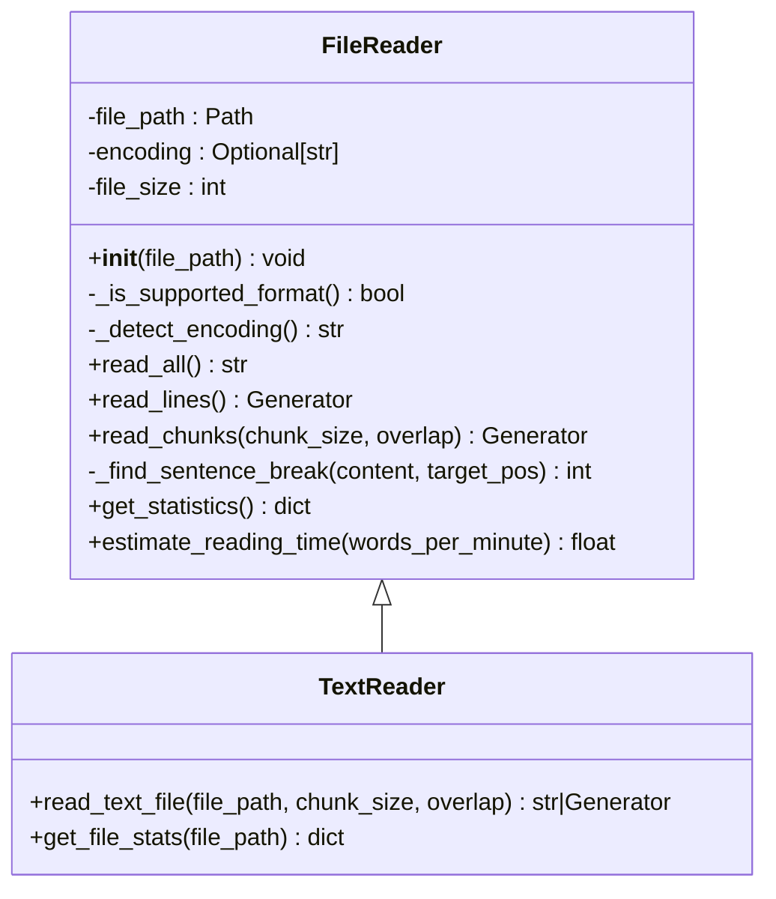
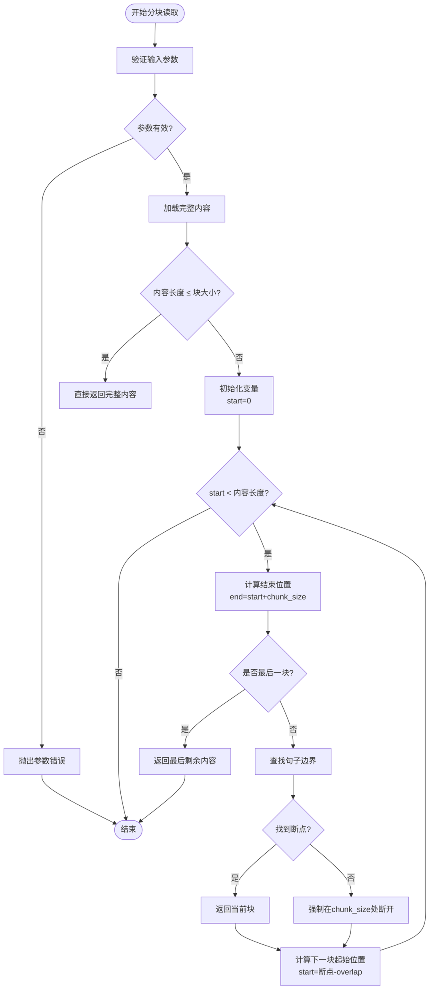
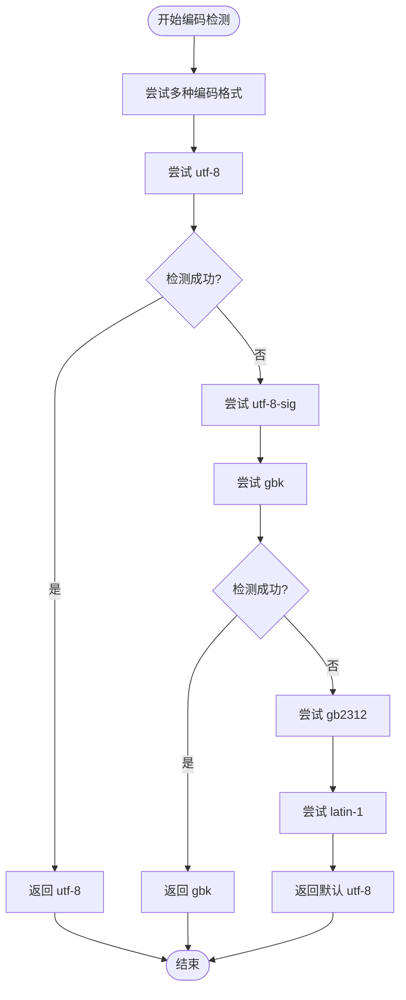
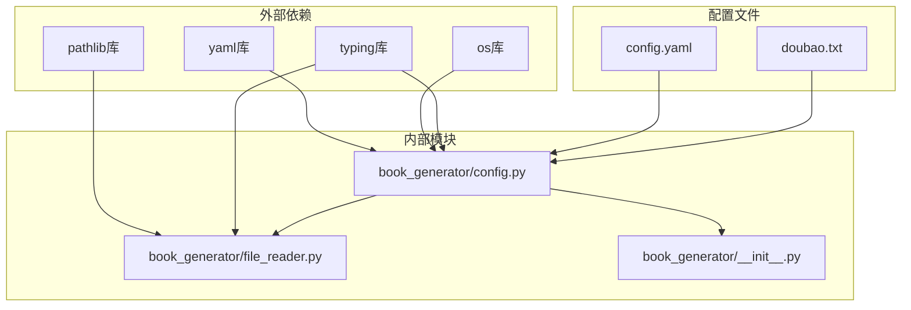

# 内容生成

<cite>
**本文引用的文件**
- [config.yaml](file://config.yaml)
- [doubao.txt](file://doubao.txt)
- [book_generator/config.py](file://book_generator/config.py)
- [book_generator/file_reader.py](file://book_generator/file_reader.py)
- [book_generator/__init__.py](file://book_generator/__init__.py)
</cite>

## 目录
1. [简介](#简介)
2. [项目结构](#项目结构)
3. [核心组件](#核心组件)
4. [架构概览](#架构概览)
5. [详细组件分析](#详细组件分析)
6. [依赖分析](#依赖分析)
7. [性能考虑](#性能考虑)
8. [故障排除指南](#故障排除指南)
9. [结论](#结论)
10. [附录](#附录)

## 简介
本项目是一个基于配置驱动的AI内容生成系统，专注于将大文本文件通过AI重新组织，生成结构完整的新书籍。系统通过统一的配置管理模块加载和管理所有配置项，包括API配置、生成配置、处理配置和文档格式配置。

该系统的核心价值在于：
- **配置驱动**：通过YAML配置文件集中管理所有参数
- **模块化设计**：清晰分离配置管理、文件读取、内容生成等功能模块
- **可扩展性**：支持多种AI服务提供商和不同的生成策略
- **易用性**：提供简洁的API接口和详细的错误处理机制

## 项目结构
项目采用模块化的文件组织结构，主要包含以下核心文件：



**图表来源**
- [config.yaml:1-47](file://config.yaml#L1-L47)
- [book_generator/config.py:1-324](file://book_generator/config.py#L1-L324)

**章节来源**
- [config.yaml:1-47](file://config.yaml#L1-L47)
- [book_generator/config.py:1-324](file://book_generator/config.py#L1-L324)
- [book_generator/file_reader.py:1-274](file://book_generator/file_reader.py#L1-L274)
- [book_generator/__init__.py:1-12](file://book_generator/__init__.py#L1-L12)

## 核心组件
系统由三个核心组件构成，每个组件都有明确的职责分工：

### 配置管理组件
配置管理组件是整个系统的基础，负责：
- 从YAML文件加载配置
- 提供统一的配置访问接口
- 支持默认值和覆盖配置的合并
- 实现单例模式确保配置的一致性

### 文件读取组件
文件读取组件专门处理大文本文件的读取和分块：
- 支持MD和TXT格式文件
- 自动检测文件编码
- 提供分块读取功能
- 支持句子边界智能断开

### AI内容生成组件
虽然当前代码库中AI内容生成的具体实现尚未完全展示，但从现有代码可以看出：
- 支持多种文风风格配置
- 可配置章节目标字数和总章节数
- 提供灵活的生成参数控制

**章节来源**
- [book_generator/config.py:12-288](file://book_generator/config.py#L12-L288)
- [book_generator/file_reader.py:13-241](file://book_generator/file_reader.py#L13-L241)

## 架构概览
系统采用分层架构设计，各层之间职责清晰，耦合度低：



**图表来源**
- [book_generator/config.py:294-324](file://book_generator/config.py#L294-L324)
- [book_generator/file_reader.py:13-274](file://book_generator/file_reader.py#L13-L274)

系统的关键特性包括：
- **单例模式**：确保配置的唯一性和一致性
- **延迟加载**：按需加载配置文件，提高启动效率
- **类型安全**：使用类型注解确保代码质量
- **异常处理**：完善的错误处理和恢复机制

## 详细组件分析

### 配置管理系统
配置管理系统是整个应用的核心基础设施，提供了统一的配置访问接口。

#### 配置类设计


**图表来源**
- [book_generator/config.py:12-324](file://book_generator/config.py#L12-L324)

#### 配置加载流程


**图表来源**
- [book_generator/config.py:50-74](file://book_generator/config.py#L50-L74)
- [book_generator/config.py:112-128](file://book_generator/config.py#L112-L128)

#### 配置访问模式
系统提供了多种配置访问方式：

1. **直接访问**：`config.get('doubao', 'api_key')`
2. **专用方法**：`config.get_doubao_api_key()`
3. **嵌套访问**：支持多级键路径访问

**章节来源**
- [book_generator/config.py:130-148](file://book_generator/config.py#L130-L148)
- [book_generator/config.py:150-194](file://book_generator/config.py#L150-L194)

### 文件读取系统
文件读取系统专门处理大文本文件的读取和分块处理。

#### 文件读取器设计


**图表来源**
- [book_generator/file_reader.py:13-274](file://book_generator/file_reader.py#L13-L274)

#### 分块读取算法
文件读取系统实现了智能的分块读取算法：



**图表来源**
- [book_generator/file_reader.py:118-162](file://book_generator/file_reader.py#L118-L162)
- [book_generator/file_reader.py:166-193](file://book_generator/file_reader.py#L166-L193)

#### 编码检测机制
系统实现了智能的编码检测机制：



**图表来源**
- [book_generator/file_reader.py:65-84](file://book_generator/file_reader.py#L65-L84)

**章节来源**
- [book_generator/file_reader.py:13-274](file://book_generator/file_reader.py#L13-L274)

### 配置参数详解
系统提供了丰富的配置参数，涵盖AI服务、生成策略、处理参数和文档格式等多个方面。

#### AI服务配置
| 参数名 | 类型 | 默认值 | 描述 |
|--------|------|--------|------|
| `doubao.api_key` | 字符串 | 空字符串 | 豆包API密钥 |
| `doubao.model` | 字符串 | `doubao-seed-1-8-251228` | AI模型名称 |
| `doubao.base_url` | 字符串 | `https://ark.cn-beijing.volces.com/api/v3` | API基础URL |
| `doubao.timeout` | 整数 | 120 | 请求超时时间（秒） |
| `doubao.max_retries` | 整数 | 3 | 最大重试次数 |

#### 生成配置
| 参数名 | 类型 | 默认值 | 描述 |
|--------|------|--------|------|
| `generation.style` | 字符串 | `plain` | 文风风格 |
| `generation.chapter_target_words` | 整数 | 35000 | 每章目标字数 |
| `generation.total_chapters` | 整数 | 15 | 总章节数 |
| `generation.generate_preface` | 布尔值 | True | 是否生成自序 |
| `generation.output_filename` | 字符串 | `generated_book.docx` | 输出文件名 |

#### 处理配置
| 参数名 | 类型 | 默认值 | 描述 |
|--------|------|--------|------|
| `processing.chunk_size` | 整数 | 4000 | 文本分块大小（字符数） |
| `processing.chunk_overlap` | 整数 | 500 | 分块重叠大小 |
| `processing.request_interval` | 浮点数 | 1.0 | 请求间隔（秒） |
| `processing.save_intermediate` | 布尔值 | True | 是否保存中间结果 |
| `processing.temp_dir` | 字符串 | `./temp` | 临时文件目录 |

#### 文档格式配置
| 参数名 | 类型 | 默认值 | 描述 |
|--------|------|--------|------|
| `document.body_font` | 字符串 | `宋体` | 正文字体 |
| `document.body_size` | 整数 | 12 | 正文字号 |
| `document.title_font` | 字符串 | `黑体` | 标题字体 |
| `document.line_spacing` | 浮点数 | 1.5 | 行距 |

**章节来源**
- [book_generator/config.py:82-110](file://book_generator/config.py#L82-L110)
- [config.yaml:3-46](file://config.yaml#L3-L46)

## 依赖分析
系统采用松耦合的设计，各组件之间的依赖关系清晰明确。



**图表来源**
- [book_generator/config.py:7-9](file://book_generator/config.py#L7-L9)
- [book_generator/file_reader.py:7-10](file://book_generator/file_reader.py#L7-L10)

### 依赖关系特点
- **低耦合高内聚**：每个模块职责单一，相互依赖度低
- **类型安全**：广泛使用类型注解，提高代码质量
- **异常隔离**：错误处理集中在相应模块，不影响其他模块运行
- **配置驱动**：通过配置文件实现功能开关和参数控制

**章节来源**
- [book_generator/config.py:7-9](file://book_generator/config.py#L7-L9)
- [book_generator/file_reader.py:7-10](file://book_generator/file_reader.py#L7-L10)

## 性能考虑
系统在设计时充分考虑了性能优化，特别是在处理大文件和网络请求方面。

### 文件处理性能优化
1. **内存友好**：提供生成器接口，避免一次性加载大文件到内存
2. **智能分块**：根据句子边界断开，避免单词截断
3. **编码优化**：快速编码检测，减少不必要的文件读取尝试

### 配置加载性能优化
1. **单例模式**：避免重复创建配置实例
2. **延迟加载**：按需加载配置文件
3. **缓存机制**：配置数据在内存中缓存

### 网络请求性能优化
1. **超时控制**：可配置的请求超时时间
2. **重试机制**：自动重试失败的请求
3. **请求间隔**：可配置的请求间隔，避免API限流

## 故障排除指南

### 常见配置问题
**问题1：API密钥未配置**
- 症状：运行时抛出ValueError异常
- 解决方案：在config.yaml中正确配置doubao.api_key
- 预防措施：启动时检查配置完整性

**问题2：配置文件格式错误**
- 症状：配置文件解析失败，使用默认配置
- 解决方案：检查YAML语法，确保正确的缩进和格式
- 预防措施：使用YAML验证工具检查配置文件

**问题3：文件路径错误**
- 症状：FileNotFoundError异常
- 解决方案：确认文件路径正确，文件存在
- 预防措施：使用绝对路径或相对路径验证

### 文件读取问题
**问题4：编码检测失败**
- 症状：文件读取异常或乱码
- 解决方案：手动指定文件编码，或转换文件编码
- 预防措施：使用标准编码格式保存文件

**问题5：大文件处理缓慢**
- 症状：内存占用过高，处理速度慢
- 解决方案：使用分块读取功能，调整chunk_size参数
- 预防措施：监控内存使用情况

### 系统集成问题
**问题6：配置热更新失效**
- 症状：修改配置文件后未生效
- 解决方案：调用reload_config()函数重新加载配置
- 预防措施：在配置变更后主动触发重新加载

**章节来源**
- [book_generator/config.py:66-74](file://book_generator/config.py#L66-L74)
- [book_generator/file_reader.py:44-50](file://book_generator/file_reader.py#L44-L50)
- [book_generator/config.py:160-162](file://book_generator/config.py#L160-L162)

## 结论
本项目提供了一个结构清晰、配置驱动的AI内容生成系统。通过模块化的架构设计和完善的配置管理机制，系统具备了良好的可扩展性和维护性。

### 主要优势
1. **配置驱动**：通过YAML文件集中管理所有配置参数
2. **模块化设计**：职责分离，便于测试和维护
3. **类型安全**：全面的类型注解确保代码质量
4. **异常处理**：完善的错误处理和恢复机制
5. **性能优化**：针对大文件处理和网络请求的优化

### 技术特色
- 单例模式确保配置一致性
- 智能编码检测提升兼容性
- 生成器接口支持内存友好的大文件处理
- 可配置的重试机制增强网络请求稳定性

### 发展方向
1. **AI服务集成**：实现具体的AI内容生成接口
2. **多格式支持**：扩展支持更多文档格式
3. **并发处理**：实现多线程/多进程的内容生成
4. **监控告警**：添加系统状态监控和告警机制

## 附录

### 使用示例
以下是一些常见的使用场景和配置示例：

#### 基础配置示例
```yaml
# 基础配置
doubao:
  api_key: "your-api-key-here"
  model: "doubao-seed-1-8-251228"
  base_url: "https://ark.cn-beijing.volces.com/api/v3"
```

#### 高级生成配置
```yaml
# 高级生成配置
generation:
  style: "literary"
  chapter_target_words: 50000
  total_chapters: 20
  generate_preface: true
  output_filename: "my_book.docx"
```

#### 性能优化配置
```yaml
# 性能优化配置
processing:
  chunk_size: 8000
  chunk_overlap: 1000
  request_interval: 2.0
  save_intermediate: false
  temp_dir: "/tmp"
```

### API参考
系统提供了简洁的API接口：

#### 配置访问API
- `get_config(config_path="config.yaml")` - 获取全局配置实例
- `reload_config(config_path="config.yaml")` - 重新加载配置
- `config.get_doubao_api_key()` - 获取API密钥
- `config.get_doubao_model()` - 获取模型名称
- `config.get_doubao_base_url()` - 获取API基础URL

#### 文件读取API
- `FileReader(file_path)` - 创建文件读取器
- `reader.read_chunks(chunk_size, overlap)` - 分块读取文件
- `read_text_file(file_path, chunk_size, overlap)` - 便捷文件读取函数

**章节来源**
- [book_generator/config.py:294-324](file://book_generator/config.py#L294-L324)
- [book_generator/file_reader.py:241-274](file://book_generator/file_reader.py#L241-L274)