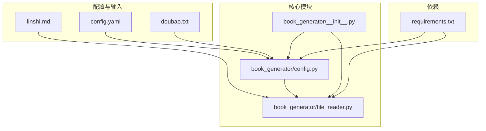
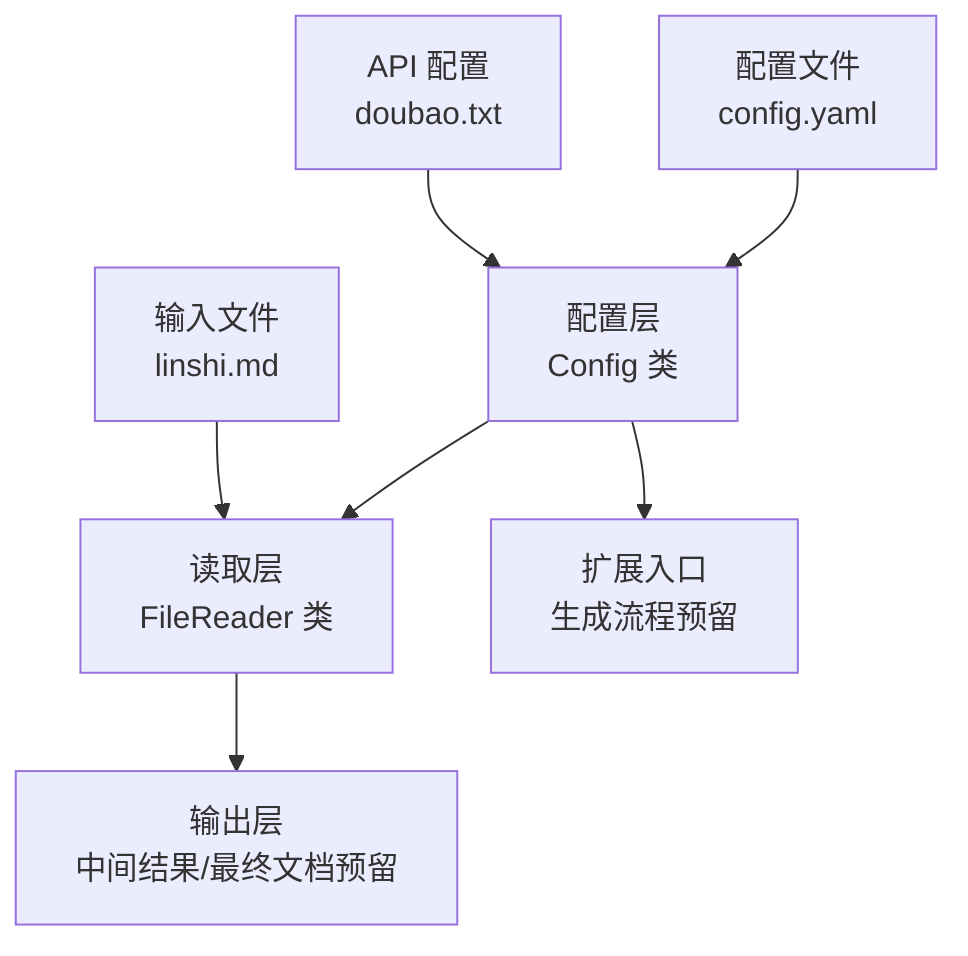
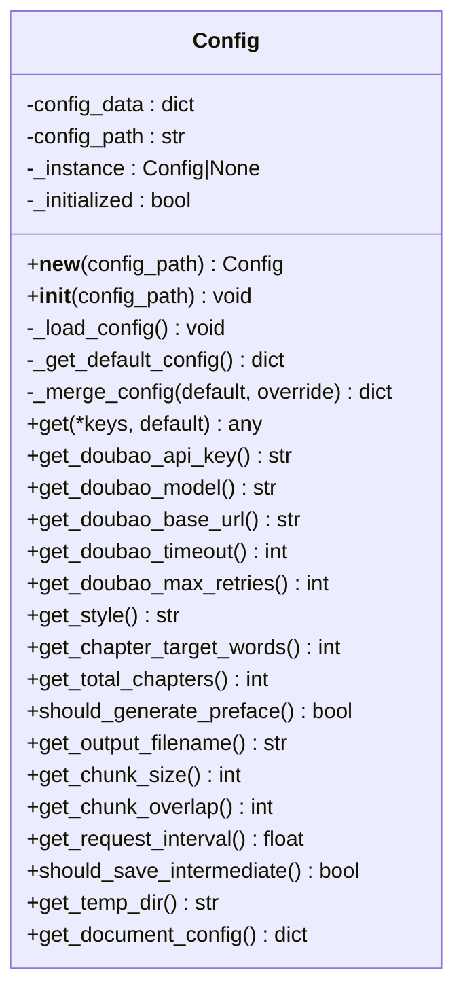
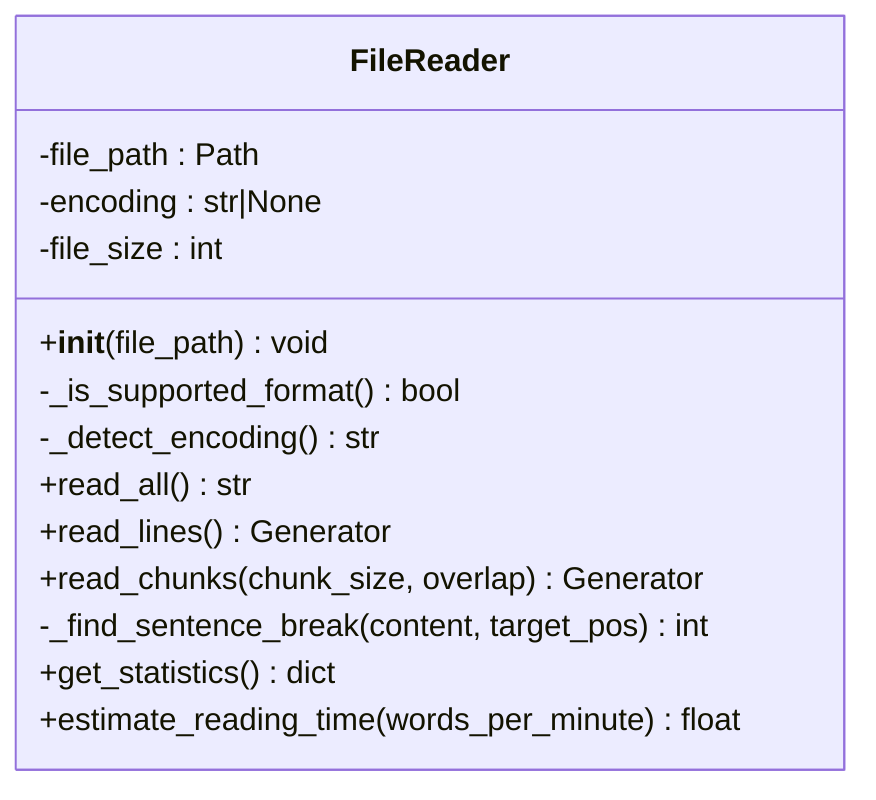
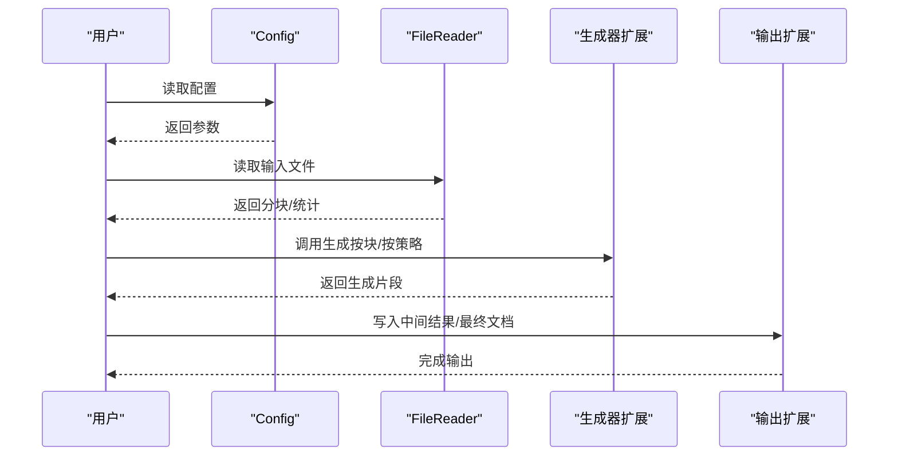
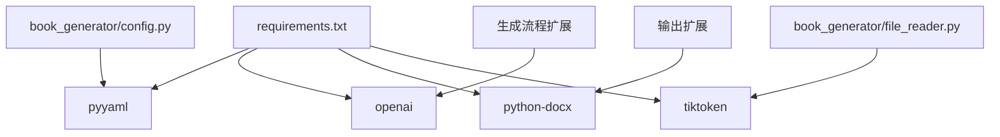

# 开发者指南

<cite>
**本文引用的文件**
- [config.yaml](file://config.yaml)
- [book_generator/config.py](file://book_generator/config.py)
- [book_generator/file_reader.py](file://book_generator/file_reader.py)
- [book_generator/__init__.py](file://book_generator/__init__.py)
- [requirements.txt](file://requirements.txt)
- [doubao.txt](file://doubao.txt)
- [linshi.md](file://linshi.md)
</cite>

## 目录
1. [简介](#简介)
2. [项目结构](#项目结构)
3. [核心组件](#核心组件)
4. [架构概览](#架构概览)
5. [详细组件分析](#详细组件分析)
6. [依赖分析](#依赖分析)
7. [性能考虑](#性能考虑)
8. [故障排查指南](#故障排查指南)
9. [结论](#结论)
10. [附录](#附录)

## 简介
本指南面向开发者，围绕“AI书籍生成器”项目提供系统化的开发与维护指导。项目采用极简架构与平面文件结构，核心职责是：
- 读取大文本文件（支持 md/txt），提供分块读取与统计分析；
- 通过配置管理统一管理 API 与生成参数；
- 提供可扩展的生成流程入口与中间结果保存能力。

项目遵循“配置即代码”的约定，所有运行参数集中在 YAML 配置文件中，便于本地化定制与 CI/CD 集成。

## 项目结构
项目采用平面文件结构，核心文件与模块如下：
- 配置文件：config.yaml（统一配置）
- 配置管理模块：book_generator/config.py（单例配置管理）
- 文件读取模块：book_generator/file_reader.py（大文件读取与分块）
- 包元信息：book_generator/__init__.py（版本与作者信息）
- 依赖声明：requirements.txt（第三方库）
- 示例输入：linshi.md（大文本示例）
- API 密钥示例：doubao.txt（豆包 API 配置）

**图示来源**
- [config.yaml:1-47](file://config.yaml#L1-L47)
- [book_generator/config.py:1-324](file://book_generator/config.py#L1-L324)
- [book_generator/file_reader.py:1-274](file://book_generator/file_reader.py#L1-L274)
- [book_generator/__init__.py:1-12](file://book_generator/__init__.py#L1-L12)
- [requirements.txt:1-5](file://requirements.txt#L1-L5)
- [doubao.txt:1-4](file://doubao.txt#L1-L4)
- [linshi.md:1-800](file://linshi.md#L1-L800)

**章节来源**
- [config.yaml:1-47](file://config.yaml#L1-L47)
- [book_generator/config.py:1-324](file://book_generator/config.py#L1-L324)
- [book_generator/file_reader.py:1-274](file://book_generator/file_reader.py#L1-L274)
- [book_generator/__init__.py:1-12](file://book_generator/__init__.py#L1-L12)
- [requirements.txt:1-5](file://requirements.txt#L1-L5)
- [doubao.txt:1-4](file://doubao.txt#L1-L4)
- [linshi.md:1-800](file://linshi.md#L1-L800)

## 核心组件
- 配置管理（Config 类）
  - 单例模式，支持从 YAML 加载与默认值合并；
  - 提供多级键访问与类型安全的读取接口；
  - 豆包 API 参数、生成参数、处理参数、文档格式参数均在此集中管理。
- 文件读取（FileReader 类）
  - 支持 md/txt 读取，自动检测编码；
  - 提供整文件读取、逐行迭代、分块读取（支持句段边界断开与重叠）；
  - 提供统计信息与阅读时间估算。

**章节来源**
- [book_generator/config.py:12-324](file://book_generator/config.py#L12-L324)
- [book_generator/file_reader.py:13-274](file://book_generator/file_reader.py#L13-L274)

## 架构概览
项目采用“配置驱动 + 模块化读取”的极简架构：
- 配置层：集中管理所有运行参数；
- 读取层：面向大文本的高性能读取与分块；
- 扩展层：通过配置与模块接口扩展生成流程与输出格式。

**图示来源**
- [book_generator/config.py:12-324](file://book_generator/config.py#L12-L324)
- [book_generator/file_reader.py:13-274](file://book_generator/file_reader.py#L13-L274)
- [config.yaml:1-47](file://config.yaml#L1-L47)
- [doubao.txt:1-4](file://doubao.txt#L1-L4)
- [linshi.md:1-800](file://linshi.md#L1-L800)

## 详细组件分析

### 配置管理模块（Config）
- 设计要点
  - 单例模式确保全局一致的配置实例；
  - 递归合并默认配置与文件配置，保证最小改动；
  - 多级键访问与类型安全读取，降低调用方错误；
  - 对缺失 API 密钥等关键配置提供明确异常提示。
- 数据结构与复杂度
  - 配置字典为 O(N) 存储（N 为配置项数量）；
  - 递归合并为 O(N+M)（N、M 为默认与文件配置项数）；
  - 键访问为 O(L)（L 为键链长度）。
- 错误处理
  - 配置文件解析失败或读取异常时回退默认配置；
  - 缺失 API 密钥时抛出明确异常，便于上层处理。
- 扩展建议
  - 新增配置项时优先在默认配置中添加；
  - 通过 get 方法族提供类型转换与默认值，避免类型错误；
  - 对敏感配置（如 API 密钥）建议通过环境变量注入并在加载后校验。

**图示来源**
- [book_generator/config.py:12-324](file://book_generator/config.py#L12-L324)

**章节来源**
- [book_generator/config.py:12-324](file://book_generator/config.py#L12-L324)
- [config.yaml:1-47](file://config.yaml#L1-L47)
- [doubao.txt:1-4](file://doubao.txt#L1-L4)

### 文件读取模块（FileReader）
- 设计要点
  - 支持 md/txt 格式与多种编码检测；
  - 分块读取时优先在句段边界断开，避免词语截断；
  - 提供统计信息（字符数、行数、估算字数等）与阅读时间估算。
- 数据结构与复杂度
  - 整文件读取为 O(S)（S 为文件大小）；
  - 分块读取为 O(S/P)（P 为平均块大小）；
  - 句段断点查找为 O(K)（K 为搜索范围）。
- 错误处理
  - 文件不存在或格式不支持时抛出异常；
  - 编码检测失败时回退 UTF-8 并提示。
- 扩展建议
  - 新增格式支持时在格式检测处扩展；
  - 分块算法可根据业务需求调整断点策略（如段落、标题级别）。

**图示来源**
- [book_generator/file_reader.py:13-274](file://book_generator/file_reader.py#L13-L274)

**章节来源**
- [book_generator/file_reader.py:13-274](file://book_generator/file_reader.py#L13-L274)
- [linshi.md:1-800](file://linshi.md#L1-L800)

### 生成流程（扩展路径）
- 当前状态
  - 读取与配置模块完备，生成流程与输出模块为预留扩展点。
- 扩展建议
  - 在配置中新增生成参数（如风格、章节目标字数、输出格式等）；
  - 在读取模块基础上，对接 AI 服务（如豆包 API），实现分块生成与合并；
  - 通过中间结果保存与断点续跑，提升大文本生成的可靠性；
  - 输出层支持 docx、epub、mobi 等格式，结合文档配置模块统一管理样式。

**图示来源**
- [book_generator/config.py:12-324](file://book_generator/config.py#L12-L324)
- [book_generator/file_reader.py:13-274](file://book_generator/file_reader.py#L13-L274)
- [config.yaml:1-47](file://config.yaml#L1-L47)

## 依赖分析
- Python 版本与第三方库
  - openai：AI 服务调用（如豆包 API）；
  - python-docx：文档生成（如 DOCX）；
  - pyyaml：配置文件解析；
  - tiktoken：文本分块与 token 计算（如需）。
- 依赖关系
  - 配置模块依赖 pyyaml；
  - 生成流程可依赖 openai；
  - 输出模块可依赖 python-docx；
  - 若启用 token 计数，可依赖 tiktoken。

**图示来源**
- [requirements.txt:1-5](file://requirements.txt#L1-L5)
- [book_generator/config.py:7-9](file://book_generator/config.py#L7-L9)
- [book_generator/file_reader.py:7-10](file://book_generator/file_reader.py#L7-L10)

**章节来源**
- [requirements.txt:1-5](file://requirements.txt#L1-L5)
- [book_generator/config.py:7-9](file://book_generator/config.py#L7-L9)
- [book_generator/file_reader.py:7-10](file://book_generator/file_reader.py#L7-L10)

## 性能考虑
- 文件读取
  - 大文件优先使用分块读取与逐行迭代，避免一次性加载内存；
  - 分块断点尽量在句段边界，减少词语截断带来的二次处理成本。
- 配置加载
  - 单例模式避免重复解析配置文件；
  - 合并策略采用递归合并，减少配置项缺失导致的重复判断。
- 生成流程
  - 控制请求间隔与重试次数，避免触发服务限流；
  - 使用中间结果保存与断点续跑，提高大文本生成的稳定性。
- 文档输出
  - 统一字体、字号、行距等样式，减少样式变更带来的重排成本。

[本节为通用性能建议，不直接分析具体文件]

## 故障排查指南
- 配置文件相关
  - 配置文件解析失败：检查 YAML 语法与编码；确认默认配置回退逻辑是否生效。
  - API 密钥缺失：检查配置项是否存在；确认环境变量注入是否正确。
- 文件读取相关
  - 文件不存在或格式不支持：确认文件路径与扩展名；检查支持格式列表。
  - 编码检测失败：确认文件实际编码；必要时手动指定编码。
- 生成流程相关
  - 请求超时或重试过多：检查网络与服务端状态；适当调整超时与重试参数。
  - 中间结果异常：检查临时目录权限与磁盘空间；确认断点续跑逻辑。

**章节来源**
- [book_generator/config.py:50-74](file://book_generator/config.py#L50-L74)
- [book_generator/file_reader.py:44-50](file://book_generator/file_reader.py#L44-L50)
- [config.yaml:1-47](file://config.yaml#L1-L47)

## 结论
本项目以“配置驱动 + 模块化读取”为核心，提供了清晰的扩展路径与稳健的维护基础。开发者可基于现有模块快速接入 AI 生成与多格式输出，同时通过配置中心与单例配置管理保障一致性与可维护性。建议在扩展新功能时遵循“最小改动、类型安全、错误明确”的原则，确保系统在复杂场景下仍保持高可用与可演进性。

[本节为总结性内容，不直接分析具体文件]

## 附录

### 文件格式规范与编辑建议
- 配置文件（YAML）
  - 使用缩进表示层级，避免混用空格与制表符；
  - 字符串值建议加引号，避免特殊字符被转义；
  - 注释使用英文，便于国际化协作。
- 输入文件（md/txt）
  - 统一使用 UTF-8 编码；
  - 段落与标题层级清晰，便于分块与结构化处理；
  - 避免在标题中使用未转义的特殊字符。
- 输出文件（docx/其他）
  - 通过配置模块统一管理字体、字号、行距等样式；
  - 输出前进行样式一致性校验，避免跨平台差异。

**章节来源**
- [config.yaml:1-47](file://config.yaml#L1-L47)
- [book_generator/file_reader.py:65-84](file://book_generator/file_reader.py#L65-L84)
- [book_generator/config.py:276-287](file://book_generator/config.py#L276-L287)

### 扩展功能开发指引
- 新增配置项
  - 在默认配置中添加键与默认值；
  - 提供类型安全的读取方法，避免类型错误；
  - 在配置文件中新增对应键值，保持最小改动。
- 新增输入格式
  - 在格式检测处扩展支持列表；
  - 如需特殊解析逻辑，新增解析器模块并与读取模块集成。
- 新增输出格式
  - 在输出模块中新增格式处理器；
  - 通过文档配置模块统一管理样式参数。
- 生成流程扩展
  - 在生成器中实现分块生成与合并；
  - 集成中间结果保存与断点续跑；
  - 对接 AI 服务时注意请求间隔与重试策略。

**章节来源**
- [book_generator/config.py:76-128](file://book_generator/config.py#L76-L128)
- [book_generator/file_reader.py:56-63](file://book_generator/file_reader.py#L56-L63)
- [config.yaml:11-47](file://config.yaml#L11-L47)