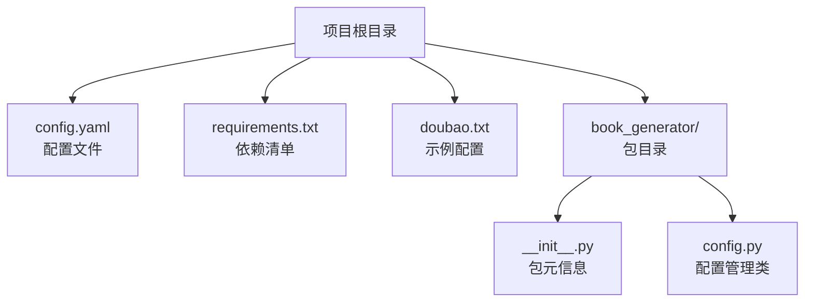
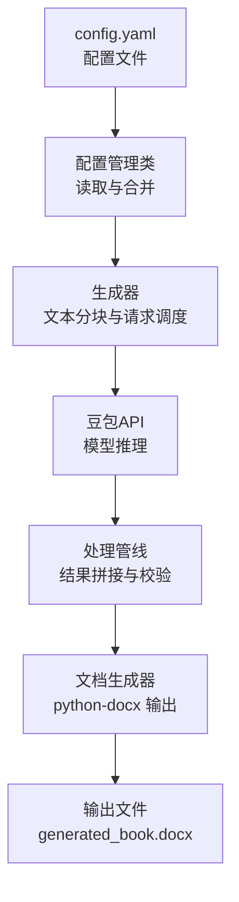
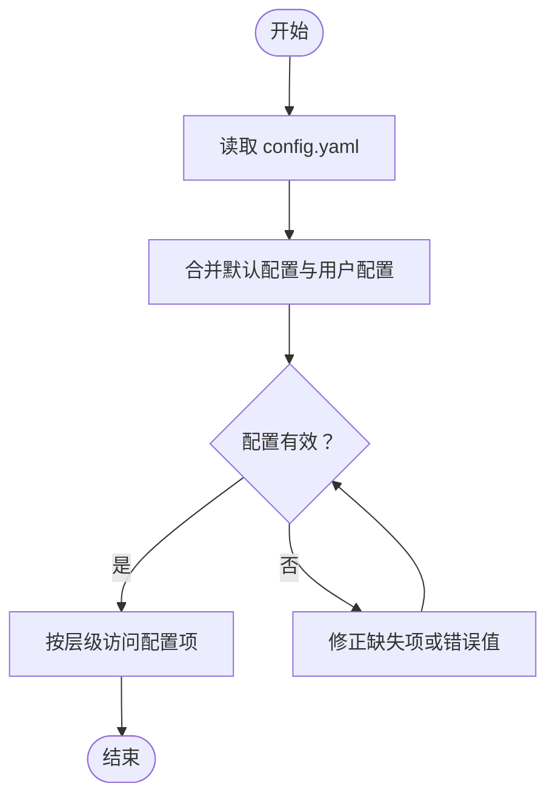
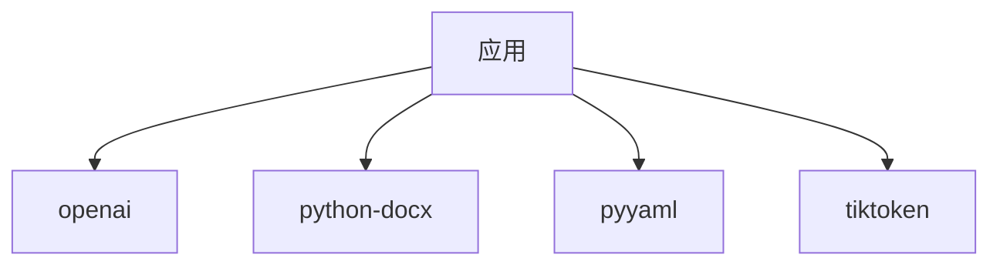

# 快速开始

<cite>
**本文引用的文件**
- [doubao.txt](file://doubao.txt)
- [config.yaml](file://config.yaml)
- [requirements.txt](file://requirements.txt)
- [book_generator/__init__.py](file://book_generator/__init__.py)
- [book_generator/config.py](file://book_generator/config.py)
</cite>

## 目录
1. [简介](#简介)
2. [项目结构](#项目结构)
3. [核心组件](#核心组件)
4. [架构概览](#架构概览)
5. [详细组件分析](#详细组件分析)
6. [依赖分析](#依赖分析)
7. [性能注意事项](#性能注意事项)
8. [故障排除指南](#故障排除指南)
9. [结论](#结论)
10. [附录](#附录)

## 简介
本项目是一个基于大模型的“AI辅助书籍生成器”，能够将大型文本文件通过AI重新组织，生成结构完整的新书籍。项目提供了完整的配置文件与依赖说明，便于快速搭建与使用。

- 项目目标：通过AI对长文本进行结构化重组，输出高质量的书籍文档。
- 使用场景：适合需要将大量素材整理为章节完整、风格统一的小说或书籍内容。
- 技术栈：Python 3.x，OpenAI SDK，python-docx，PyYAML，tiktoken 等。

**章节来源**
- [book_generator/__init__.py:1-12](file://book_generator/__init__.py#L1-L12)

## 项目结构
项目采用“功能模块 + 配置文件”的组织方式，核心文件与目录如下：
- doubao.txt：示例的API密钥与模型配置（仅供演示，不建议直接使用）
- config.yaml：正式使用的配置文件，包含豆包API配置、生成参数、处理参数与文档格式
- requirements.txt：Python 依赖列表
- book_generator/__init__.py：包元信息（版本、作者等）
- book_generator/config.py：配置管理类，负责读取与合并配置

**图表来源**
- [config.yaml:1-47](file://config.yaml#L1-L47)
- [requirements.txt:1-5](file://requirements.txt#L1-L5)
- [doubao.txt:1-4](file://doubao.txt#L1-L4)
- [book_generator/__init__.py:1-12](file://book_generator/__init__.py#L1-L12)
- [book_generator/config.py:75-241](file://book_generator/config.py#L75-L241)

**章节来源**
- [config.yaml:1-47](file://config.yaml#L1-L47)
- [requirements.txt:1-5](file://requirements.txt#L1-L5)
- [doubao.txt:1-4](file://doubao.txt#L1-L4)
- [book_generator/__init__.py:1-12](file://book_generator/__init__.py#L1-L12)
- [book_generator/config.py:75-241](file://book_generator/config.py#L75-L241)

## 核心组件
- 配置管理类：负责从 YAML 文件读取配置，提供默认值与合并策略，支持按层级访问配置项。
- 示例配置文件：doubao.txt 提供了API密钥、模型与基础URL的示例，便于快速替换。
- 依赖清单：requirements.txt 明确了运行所需的核心库。

关键职责与接口（来自配置管理类）：
- 获取默认配置：返回包含所有默认配置项的字典（包含豆包API、生成、处理、文档格式等）
- 合并配置：递归合并默认配置与用户覆盖配置
- 访问器方法：提供按层级获取配置项的方法，如获取文风、每章目标字数、总章节数、输出文件名、分块大小等

**章节来源**
- [book_generator/config.py:75-241](file://book_generator/config.py#L75-L241)
- [config.yaml:1-47](file://config.yaml#L1-L47)

## 架构概览
整体流程分为“配置加载 → 文本预处理 → AI生成 → 文档输出”四个阶段。下图展示了从配置到最终文档的交互关系：

**图表来源**
- [config.yaml:1-47](file://config.yaml#L1-L47)
- [book_generator/config.py:75-241](file://book_generator/config.py#L75-L241)

## 详细组件分析

### 配置文件与读取流程
- 配置文件位置与命名：config.yaml
- 主要配置段：
  - 豆包API配置：包含 api_key、model、base_url、timeout、max_retries
  - 生成配置：style、chapter_target_words、total_chapters、generate_preface、output_filename
  - 处理配置：chunk_size、chunk_overlap、request_interval、save_intermediate、temp_dir
  - 文档格式：body_font、body_size、title_font、line_spacing

**图表来源**
- [config.yaml:1-47](file://config.yaml#L1-L47)
- [book_generator/config.py:112-113](file://book_generator/config.py#L112-L113)

**章节来源**
- [config.yaml:1-47](file://config.yaml#L1-L47)
- [book_generator/config.py:75-241](file://book_generator/config.py#L75-L241)

### 示例配置与迁移
- doubao.txt 提供了示例的API密钥、模型与基础URL，便于快速替换到正式配置文件中。
- 建议将示例中的字段复制到 config.yaml 的 doubao 段落，确保与实际API一致。

**章节来源**
- [doubao.txt:1-4](file://doubao.txt#L1-L4)
- [config.yaml:3-9](file://config.yaml#L3-L9)

### 依赖与安装
- Python 版本：建议使用 Python 3.8 及以上版本
- 依赖库：openai、python-docx、pyyaml、tiktoken
- 安装方式：使用 pip 安装 requirements.txt 中列出的依赖

**章节来源**
- [requirements.txt:1-5](file://requirements.txt#L1-L5)

## 依赖分析
项目依赖关系清晰，主要库的作用如下：
- openai：与大模型服务通信，发送请求并接收响应
- python-docx：生成 Word 文档，设置标题、正文与行距
- pyyaml：解析 YAML 配置文件
- tiktoken：计算文本 token 数量，辅助成本与长度控制

**图表来源**
- [requirements.txt:1-5](file://requirements.txt#L1-L5)

**章节来源**
- [requirements.txt:1-5](file://requirements.txt#L1-L5)

## 性能注意事项
- 文本分块与重叠：合理设置 chunk_size 与 chunk_overlap，可在保证上下文连贯的同时控制请求次数与成本
- 请求间隔：通过 request_interval 控制请求频率，避免触发速率限制
- 中间结果保存：开启 save_intermediate 并指定 temp_dir，便于断点续跑与调试
- 文档格式：适当调整行距与字号，可提升阅读体验并减少输出体积

**章节来源**
- [config.yaml:24-35](file://config.yaml#L24-L35)
- [book_generator/config.py:236-241](file://book_generator/config.py#L236-L241)

## 故障排除指南
- API密钥无效或过期
  - 现象：请求失败或返回鉴权错误
  - 处理：检查 config.yaml 中的 api_key 是否正确，必要时重新申请并替换
  - 参考：[config.yaml:5](file://config.yaml#L5)
- 模型或基础URL不匹配
  - 现象：请求地址不可达或返回未知模型错误
  - 处理：确认 model 与 base_url 与官方文档一致，必要时更新
  - 参考：[config.yaml:6-7](file://config.yaml#L6-L7)
- 生成参数不合理
  - 现象：输出质量不佳或生成时间过长
  - 处理：调整 style、chapter_target_words、total_chapters 等参数，使其符合预期
  - 参考：[config.yaml:12-22](file://config.yaml#L12-L22)
- 文档输出异常
  - 现象：生成的 Word 文档格式异常或内容缺失
  - 处理：检查文档格式配置（字体、字号、行距）与输出文件名
  - 参考：[config.yaml:37-46](file://config.yaml#L37-L46)
- 依赖缺失或版本冲突
  - 现象：运行时报错或功能异常
  - 处理：使用 requirements.txt 安装依赖，确保 Python 版本满足要求
  - 参考：[requirements.txt:1-5](file://requirements.txt#L1-L5)

**章节来源**
- [config.yaml:5-7](file://config.yaml#L5-L7)
- [config.yaml:12-22](file://config.yaml#L12-L22)
- [config.yaml:37-46](file://config.yaml#L37-L46)
- [requirements.txt:1-5](file://requirements.txt#L1-L5)

## 结论
通过本快速开始指南，您已了解项目的环境要求、安装步骤、配置方法与常见问题排查。建议按照以下顺序完成首次使用：
1. 准备 Python 环境并安装依赖
2. 在 config.yaml 中填写有效的 API 密钥与模型参数
3. 调整生成与处理参数以满足需求
4. 运行生成流程并检查输出文档

祝您顺利生成高质量的书籍内容！

## 附录
- 快速检查清单
  - 已安装 Python 3.8+
  - 已安装 requirements.txt 中的依赖
  - config.yaml 中的 API 密钥与模型参数已填写
  - 生成参数（文风、字数、章节数）已根据需求调整
  - 输出文件名与文档格式符合预期