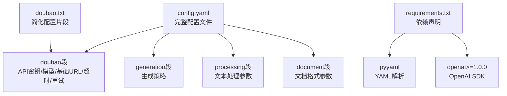
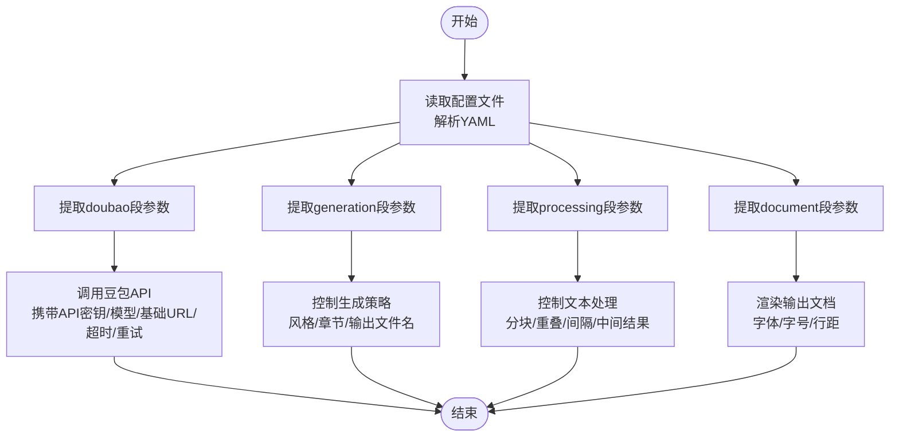
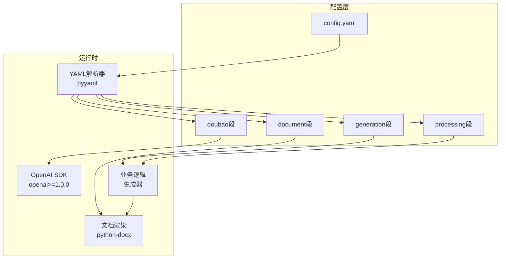
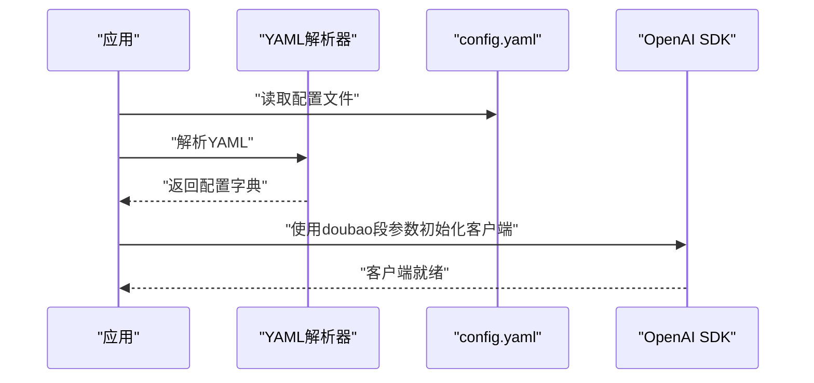
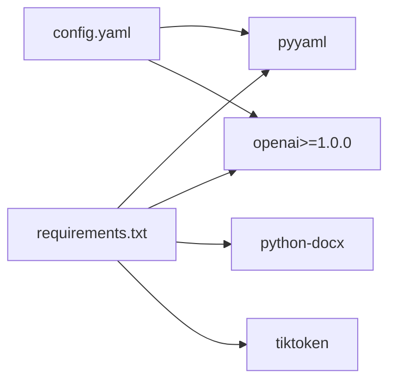

# 配置管理

<cite>
**本文引用的文件**
- [doubao.txt](file://doubao.txt)
- [config.yaml](file://config.yaml)
- [requirements.txt](file://requirements.txt)
</cite>

## 目录
1. [简介](#简介)
2. [项目结构](#项目结构)
3. [核心组件](#核心组件)
4. [架构总览](#架构总览)
5. [详细组件分析](#详细组件分析)
6. [依赖分析](#依赖分析)
7. [性能考虑](#性能考虑)
8. [故障排除指南](#故障排除指南)
9. [结论](#结论)
10. [附录](#附录)

## 简介
本文件面向“配置管理系统”的使用者与维护者，围绕豆包（Doubao）相关配置进行系统化说明。重点覆盖以下方面：
- Doubao配置项的来源与作用：API密钥、模型名称、基础URL等
- 配置文件的结构与读取方式
- 与外部依赖（如OpenAI SDK、YAML解析库）的关系
- 常见问题与排错建议
- 使用模式与最佳实践

本说明既适合初学者快速上手，也为有经验的开发者提供足够的技术深度。

## 项目结构
当前仓库包含如下与配置管理直接相关的文件：
- config.yaml：完整的应用配置文件，包含豆包API配置、生成策略、处理参数与文档格式等
- doubao.txt：早期或简化的豆包配置片段，字段与config.yaml中的doubao段一致
- requirements.txt：运行时依赖，其中包含YAML解析库与OpenAI SDK

**图表来源**
- [config.yaml:1-47](file://config.yaml#L1-L47)
- [doubao.txt:1-4](file://doubao.txt#L1-L4)
- [requirements.txt:1-5](file://requirements.txt#L1-L5)

**章节来源**
- [config.yaml:1-47](file://config.yaml#L1-L47)
- [doubao.txt:1-4](file://doubao.txt#L1-L4)
- [requirements.txt:1-5](file://requirements.txt#L1-L5)

## 核心组件
本节聚焦于“豆包配置”（doubao段）在系统中的角色与职责，以及与其它配置段的协作关系。

- Doubao配置段（doubao）用于定义与豆包服务交互所需的认证与调用参数，包括：
  - API密钥：用于身份验证
  - 模型名称：指定调用的具体模型
  - 基础URL：服务端点地址
  - 超时时间：请求超时阈值
  - 最大重试次数：网络异常时的重试策略

- 生成配置段（generation）与处理配置段（processing）分别控制生成风格、章节目标、文本分块与请求间隔等行为；这些参数与豆包配置共同决定最终的生成流程与质量。

- 文档格式段（document）用于控制输出文档的字体、字号与行距等样式参数。

**图表来源**
- [config.yaml:1-47](file://config.yaml#L1-L47)

**章节来源**
- [config.yaml:1-47](file://config.yaml#L1-L47)

## 架构总览
下图展示了配置在系统中的位置与流向：配置文件被解析后，分别驱动API调用、生成策略、处理流程与文档渲染。

**图表来源**
- [config.yaml:1-47](file://config.yaml#L1-L47)
- [requirements.txt:1-5](file://requirements.txt#L1-L5)

## 详细组件分析

### Doubao配置段（doubao）
- 字段说明
  - api_key：用于访问豆包服务的身份凭证
  - model：调用的模型标识
  - base_url：服务端点的基础URL
  - timeout：单次请求的超时秒数
  - max_retries：失败时的最大重试次数

- 使用模式
  - 在初始化API客户端时传入上述参数
  - 将model与base_url组合为最终请求路径
  - 结合timeout与max_retries提升稳定性

- 与其它组件的关系
  - generation段的style、chapter_target_words等影响提示词与上下文长度，间接影响API调用频率与耗时
  - processing段的request_interval与chunk_size影响请求节奏与并发压力
  - document段的输出参数不影响API调用，但与生成结果的后续处理相关

- 示例参考
  - Doubao配置项在配置文件中的位置与字段定义：[config.yaml:3-9](file://config.yaml#L3-L9)
  - Doubao配置项与生成/处理/文档段的并列关系：[config.yaml:1-47](file://config.yaml#L1-L47)

**章节来源**
- [config.yaml:3-9](file://config.yaml#L3-L9)
- [config.yaml:1-47](file://config.yaml#L1-L47)

### 配置文件结构与读取
- 文件类型与用途
  - config.yaml：集中式配置文件，包含doubao、generation、processing、document四个主要段落
  - doubao.txt：早期或简化的配置片段，字段与doubao段一致
  - requirements.txt：运行依赖，包含pyyaml与openai

- 读取流程（概念示意）
  - 应用启动时加载config.yaml
  - 使用YAML解析库读取各段配置
  - 将doubao段参数传递给API客户端初始化流程
  - 其它段参数用于控制生成策略与文档渲染

**图表来源**
- [config.yaml:1-47](file://config.yaml#L1-L47)
- [requirements.txt:1-5](file://requirements.txt#L1-L5)

**章节来源**
- [config.yaml:1-47](file://config.yaml#L1-L47)
- [requirements.txt:1-5](file://requirements.txt#L1-L5)

### 与API密钥、模型参数、基础URL的关系
- API密钥（api_key）
  - 用于鉴权，必须正确配置以避免访问被拒绝
  - 建议存储在安全位置，避免硬编码到公共仓库

- 模型参数（model）
  - 指定具体模型标识，直接影响生成效果与成本
  - 与基础URL共同决定最终请求路径

- 基础URL（base_url）
  - 服务端点地址，需与模型匹配
  - 若变更服务区域或网关，请同步更新

- 超时与重试（timeout、max_retries）
  - 提升网络不稳定场景下的成功率
  - 过小可能导致频繁超时，过大可能延长等待时间

**章节来源**
- [config.yaml:3-9](file://config.yaml#L3-L9)

## 依赖分析
- YAML解析依赖
  - pyyaml：用于解析config.yaml，确保配置键值正确映射到运行时对象
- OpenAI SDK依赖
  - openai>=1.0.0：用于与豆包API交互，支持流式响应与错误处理
- 文档处理依赖
  - python-docx：用于生成与导出最终文档
- Token计算依赖
  - tiktoken：用于估算上下文长度与成本

**图表来源**
- [requirements.txt:1-5](file://requirements.txt#L1-L5)
- [config.yaml:1-47](file://config.yaml#L1-L47)

**章节来源**
- [requirements.txt:1-5](file://requirements.txt#L1-L5)
- [config.yaml:1-47](file://config.yaml#L1-L47)

## 性能考虑
- 超时与重试
  - 合理设置timeout可避免长时间阻塞；max_retries过低易失败，过高会增加总耗时
- 请求间隔
  - processing.request_interval用于控制请求节奏，避免触发限流
- 文本分块
  - processing.chunk_size与chunk_overlap影响上下文长度与重复率，需结合模型上下文限制权衡
- 并发与资源
  - 在高并发场景下，建议配合队列与限速策略，避免资源争用

## 故障排除指南
- 访问被拒绝或鉴权失败
  - 检查api_key是否正确且未过期
  - 确认模型与基础URL匹配
  - 参考：[config.yaml:3-9](file://config.yaml#L3-L9)

- 请求超时
  - 适当增大timeout；检查网络连通性
  - 参考：[config.yaml:8](file://config.yaml#L8)

- 频繁重试仍失败
  - 检查max_retries设置；确认服务端状态
  - 参考：[config.yaml:9](file://config.yaml#L9)

- 生成速度慢或触发限流
  - 增大request_interval；减少chunk_size或提高chunk_overlap以降低单次负载
  - 参考：[config.yaml:24-35](file://config.yaml#L24-L35)

- 输出文档样式不符合预期
  - 调整document段的字体、字号与行距
  - 参考：[config.yaml:37-46](file://config.yaml#L37-L46)

- 配置文件读取异常
  - 确保YAML语法正确；检查pyyaml版本兼容性
  - 参考：[requirements.txt:3](file://requirements.txt#L3)

**章节来源**
- [config.yaml:3-9](file://config.yaml#L3-L9)
- [config.yaml:24-35](file://config.yaml#L24-L35)
- [config.yaml:37-46](file://config.yaml#L37-L46)
- [requirements.txt:3](file://requirements.txt#L3)

## 结论
- Doubao配置段是连接应用与豆包服务的关键桥梁，涵盖鉴权、模型与端点等核心要素
- 通过config.yaml集中管理配置，可清晰分离API参数、生成策略、处理参数与文档样式
- 合理设置超时与重试、请求间隔与文本分块，有助于在稳定性与效率之间取得平衡
- 建议在团队内统一配置规范，并对敏感信息（如API密钥）进行安全管控

## 附录
- 配置文件示例位置
  - 完整配置文件：[config.yaml:1-47](file://config.yaml#L1-L47)
  - 简化配置片段：[doubao.txt:1-4](file://doubao.txt#L1-L4)
- 依赖声明位置
  - 依赖清单：[requirements.txt:1-5](file://requirements.txt#L1-L5)