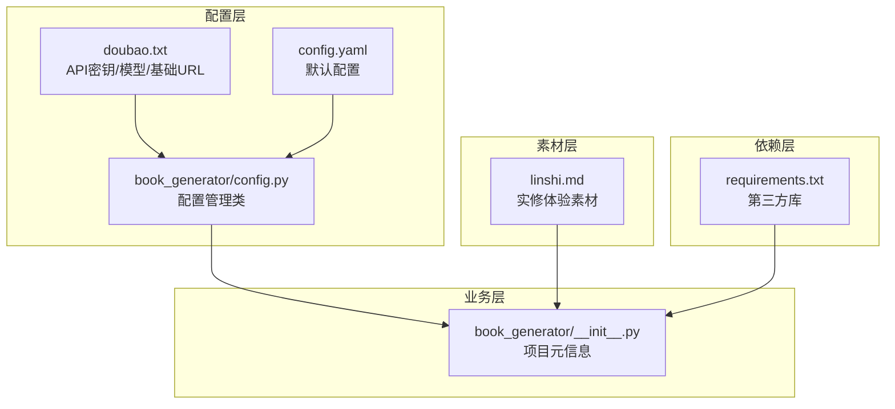
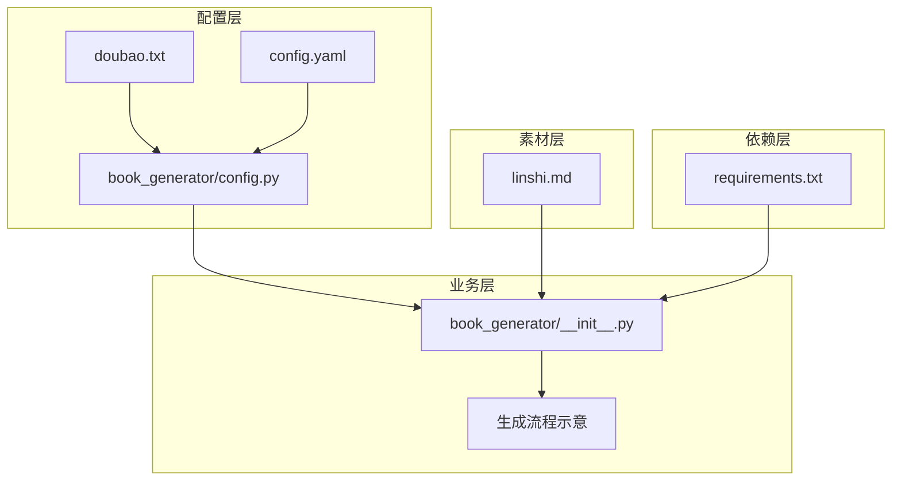
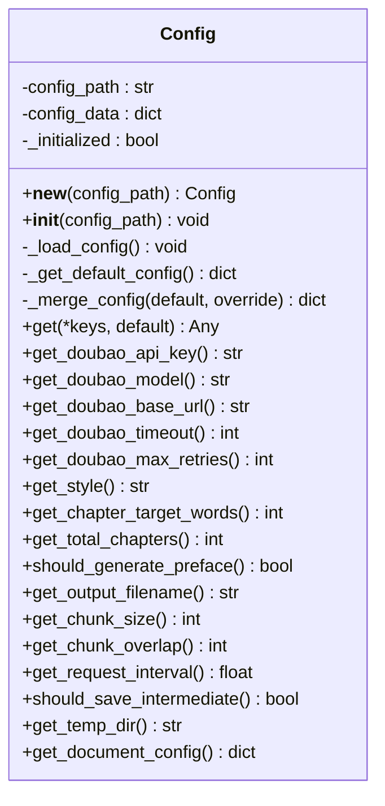
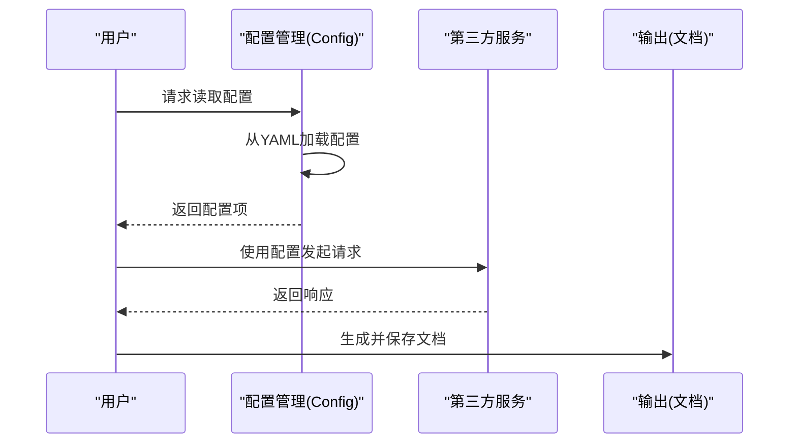
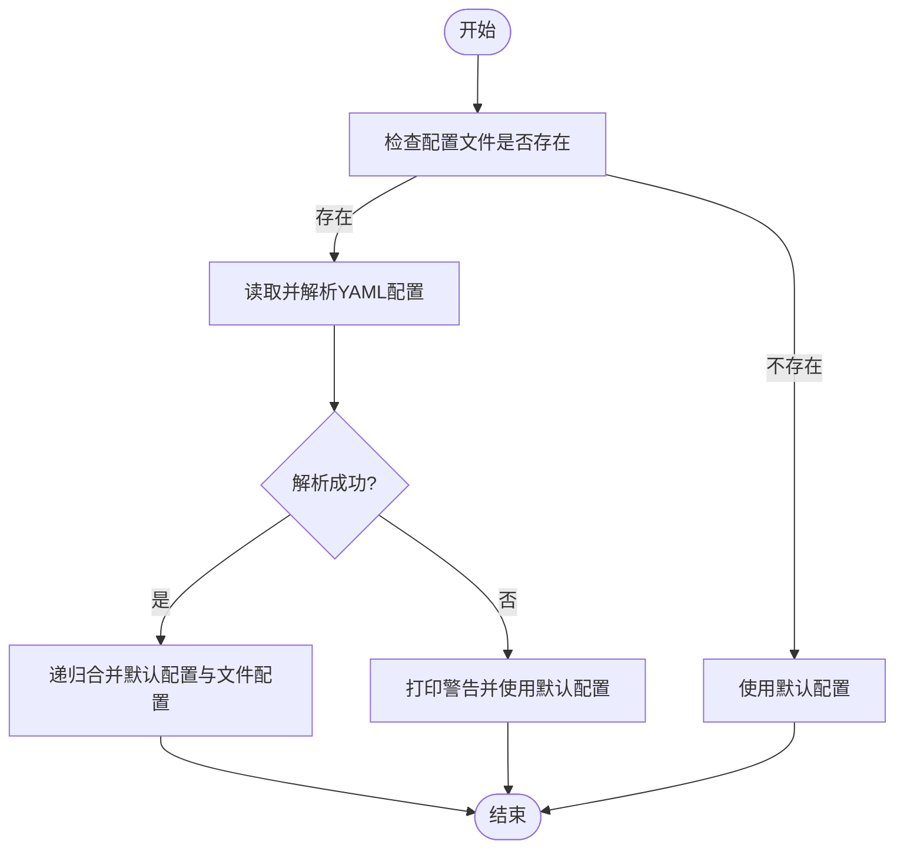
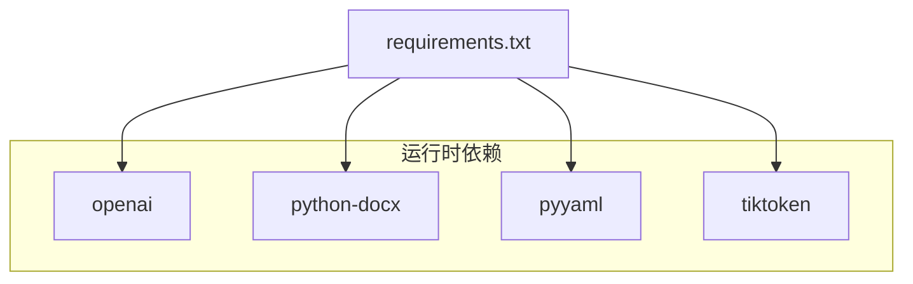

# 项目概述

<cite>
**本文引用的文件**   
- [doubao.txt](file://doubao.txt)
- [config.yaml](file://config.yaml)
- [requirements.txt](file://requirements.txt)
- [book_generator/__init__.py](file://book_generator/__init__.py)
- [book_generator/config.py](file://book_generator/config.py)
- [linshi.md](file://linshi.md)
</cite>

## 目录
1. [简介](#简介)
2. [项目结构](#项目结构)
3. [核心组件](#核心组件)
4. [架构总览](#架构总览)
5. [详细组件分析](#详细组件分析)
6. [依赖分析](#依赖分析)
7. [性能考量](#性能考量)
8. [故障排查指南](#故障排查指南)
9. [结论](#结论)
10. [附录](#附录)

## 简介
本项目是一个极简的个人实修体验记录与API配置管理示例工程，围绕“豆包”（Doubao）大模型服务的API配置与使用展开。项目采用纯文本配置与最小化依赖的设计，便于初学者理解配置加载、API调用与文档生成的协作流程。项目同时包含大量实修体验与哲学思辨内容，作为个人实修笔记的素材库，帮助读者从“实践—配置—产出”的角度理解本项目的实用价值。

- 项目目的
  - 提供一个可直接运行的API配置示例，演示如何加载配置、校验参数并调用第三方服务。
  - 以极简架构展示“配置—处理—输出”的基本工作流，适合初学者入门与有经验开发者快速集成。
  - 通过实修笔记与技术文档的并存，体现“个人实践—工具化—知识沉淀”的闭环。

- 核心理念与价值主张
  - 极简主义：仅保留必要的配置文件与配置管理模块，降低学习成本。
  - 可复用性：统一的配置接口与默认值设计，便于扩展与维护。
  - 实践导向：将API配置与实修体验结合，既可用于技术实践，也可作为个人知识资产的载体。

- 与其他组件的关系
  - 配置文件与配置管理模块共同构成“配置层”，为上层业务逻辑提供统一入口。
  - 实修笔记作为“素材层”，为生成内容提供主题与灵感来源。
  - 依赖清单定义了运行所需的第三方库，保证环境一致性。

**章节来源**
- [book_generator/__init__.py:1-12](file://book_generator/__init__.py#L1-L12)

## 项目结构
项目采用“配置层 + 业务层 + 素材层 + 依赖层”的分层组织方式，文件与目录职责清晰：

- 配置层
  - doubao.txt：包含豆包API的密钥、模型与基础URL等关键参数。
  - config.yaml：项目默认配置文件，定义生成风格、章节目标、处理参数与文档格式等。
  - book_generator/config.py：配置管理模块，负责加载、合并与提供配置项。
- 业务层
  - book_generator/__init__.py：项目元信息与版本声明。
- 素材层
  - linshi.md：实修体验与哲学思辨的长文本素材，可作为生成内容的主题来源。
- 依赖层
  - requirements.txt：项目运行所需的第三方库列表。

**图表来源**
- [doubao.txt:1-4](file://doubao.txt#L1-L4)
- [config.yaml](file://config.yaml)
- [book_generator/config.py:12-324](file://book_generator/config.py#L12-L324)
- [book_generator/__init__.py:1-12](file://book_generator/__init__.py#L1-L12)
- [linshi.md:1-800](file://linshi.md#L1-L800)
- [requirements.txt:1-5](file://requirements.txt#L1-L5)

**章节来源**
- [doubao.txt:1-4](file://doubao.txt#L1-L4)
- [config.yaml](file://config.yaml)
- [book_generator/config.py:12-324](file://book_generator/config.py#L12-L324)
- [book_generator/__init__.py:1-12](file://book_generator/__init__.py#L1-L12)
- [linshi.md:1-800](file://linshi.md#L1-L800)
- [requirements.txt:1-5](file://requirements.txt#L1-L5)

## 核心组件
- 配置管理类（Config）
  - 单例模式实现，确保全局配置一致性。
  - 支持从YAML文件加载配置，若文件缺失则回退到默认配置。
  - 提供多级键访问与类型安全的配置读取方法。
  - 关键方法包括：获取API密钥、模型、基础URL、超时、重试次数、生成风格、章节目标、处理参数与文档格式等。

- 配置文件
  - doubao.txt：包含豆包API的密钥、模型与基础URL，用于API调用。
  - config.yaml：定义生成风格、章节目标、处理参数与文档格式等默认配置。

- 依赖清单
  - requirements.txt：声明openai、python-docx、pyyaml、tiktoken等依赖，确保运行环境一致。

- 项目元信息
  - book_generator/__init__.py：包含版本与作者信息，便于项目识别与分发。

**章节来源**
- [book_generator/config.py:12-324](file://book_generator/config.py#L12-L324)
- [doubao.txt:1-4](file://doubao.txt#L1-L4)
- [config.yaml](file://config.yaml)
- [requirements.txt:1-5](file://requirements.txt#L1-L5)
- [book_generator/__init__.py:1-12](file://book_generator/__init__.py#L1-L12)

## 架构总览
项目采用“配置驱动 + 单例管理 + 默认回退”的架构设计，确保在不同环境下均能稳定运行。配置层通过统一接口向上层提供参数，业务层负责调用API与生成文档，素材层提供内容来源，依赖层保障运行环境。

**图表来源**
- [book_generator/config.py:12-324](file://book_generator/config.py#L12-L324)
- [book_generator/__init__.py:1-12](file://book_generator/__init__.py#L1-L12)
- [doubao.txt:1-4](file://doubao.txt#L1-L4)
- [config.yaml](file://config.yaml)
- [linshi.md:1-800](file://linshi.md#L1-L800)
- [requirements.txt:1-5](file://requirements.txt#L1-L5)

## 详细组件分析

### 配置管理类（Config）分析
- 设计模式
  - 使用单例模式，避免重复加载与状态不一致。
- 加载策略
  - 优先从指定路径加载YAML配置；若文件不存在或解析失败，则回退到默认配置。
  - 默认配置涵盖豆包API参数、生成参数、处理参数与文档格式等。
- 访问接口
  - 提供多级键访问与类型安全的读取方法，便于上层业务直接使用。
  - 对关键参数（如API密钥）提供显式校验与异常提示。

**图表来源**
- [book_generator/config.py:12-324](file://book_generator/config.py#L12-L324)

**章节来源**
- [book_generator/config.py:12-324](file://book_generator/config.py#L12-L324)

### API配置与调用流程
- 配置加载
  - 从doubao.txt读取API密钥、模型与基础URL。
  - 从config.yaml读取生成与处理参数。
- 参数校验
  - 若缺少关键参数（如API密钥），抛出异常提示。
- 调用执行
  - 通过统一配置接口获取参数，调用第三方服务并生成文档。

**图表来源**
- [book_generator/config.py:150-194](file://book_generator/config.py#L150-L194)
- [doubao.txt:1-4](file://doubao.txt#L1-L4)
- [config.yaml](file://config.yaml)

**章节来源**
- [book_generator/config.py:50-75](file://book_generator/config.py#L50-L75)
- [book_generator/config.py:150-194](file://book_generator/config.py#L150-L194)
- [doubao.txt:1-4](file://doubao.txt#L1-L4)
- [config.yaml](file://config.yaml)

### 复杂逻辑流程（配置合并与回退）
- 默认配置与文件配置的递归合并，确保新增字段与覆盖字段的正确处理。
- 文件不存在或解析失败时的回退策略，保证系统可用性。

**图表来源**
- [book_generator/config.py:50-75](file://book_generator/config.py#L50-L75)
- [book_generator/config.py:112-128](file://book_generator/config.py#L112-L128)

**章节来源**
- [book_generator/config.py:50-75](file://book_generator/config.py#L50-L75)
- [book_generator/config.py:112-128](file://book_generator/config.py#L112-L128)

### 概念性概述
- 配置即契约：doubao.txt与config.yaml定义了API调用与生成流程的契约，确保参数一致与可追溯。
- 单例配置：Config类提供全局唯一配置实例，避免重复加载与状态漂移。
- 默认回退：在文件缺失或解析失败时，系统自动回退到默认配置，保证最小可用性。
- 实修与工具：linshi.md作为素材库，体现“实践—工具—产出”的闭环，既可用于技术实践，也可沉淀为个人知识资产。

[本节为概念性内容，不直接分析具体文件，故不列出章节来源]

## 依赖分析
- 依赖清单（requirements.txt）
  - openai：用于与第三方服务交互。
  - python-docx：用于生成与编辑Word文档。
  - pyyaml：用于解析YAML配置文件。
  - tiktoken：用于文本分词与长度计算。

**图表来源**
- [requirements.txt:1-5](file://requirements.txt#L1-L5)

**章节来源**
- [requirements.txt:1-5](file://requirements.txt#L1-L5)

## 性能考量
- 配置加载
  - 单例模式避免重复IO与解析，提升性能与稳定性。
  - 默认配置与文件配置的合并采用递归策略，复杂度与嵌套深度相关。
- 文本处理
  - 分块大小与重叠参数影响处理效率与上下文完整性，需根据输入规模与API限制进行权衡。
- I/O与并发
  - 请求间隔与重试次数影响整体吞吐与稳定性，建议结合API限流策略进行调优。

[本节提供通用指导，不直接分析具体文件，故不列出章节来源]

## 故障排查指南
- 配置文件解析失败
  - 现象：系统回退到默认配置并打印警告。
  - 排查：检查YAML语法与键名拼写，确保编码为UTF-8。
- API密钥未配置
  - 现象：读取API密钥时报错，提示未配置。
  - 排查：在config.yaml中设置doubao.api_key，或在运行环境中提供有效密钥。
- 生成流程异常
  - 现象：生成文档失败或内容异常。
  - 排查：检查生成风格、章节目标、处理参数与输出文件名，确保路径可写。

**章节来源**
- [book_generator/config.py:66-71](file://book_generator/config.py#L66-L71)
- [book_generator/config.py:159-162](file://book_generator/config.py#L159-L162)

## 结论
本项目以极简架构展示了“配置—处理—输出”的基本流程，通过统一的配置管理与默认回退策略，确保在不同环境下均可稳定运行。doubao.txt与config.yaml作为配置契约，book_generator/config.py提供类型安全的访问接口，linshi.md作为素材来源，requirements.txt保障运行环境。该设计既适合初学者快速上手，也为有经验开发者提供了可扩展的基础设施。

[本节为总结性内容，不直接分析具体文件，故不列出章节来源]

## 附录
- 常见用例示例
  - 加载配置：通过Config类读取API密钥、模型与基础URL。
  - 生成文档：根据生成风格与章节目标，调用API并生成Word文档。
  - 调整参数：在config.yaml中修改分块大小、重叠与请求间隔，以适配不同输入规模。
- 实修素材使用
  - 将linshi.md中的实修体验作为生成内容的主题来源，结合配置参数进行个性化定制。

**章节来源**
- [book_generator/config.py:130-148](file://book_generator/config.py#L130-L148)
- [config.yaml](file://config.yaml)
- [linshi.md:1-800](file://linshi.md#L1-L800)